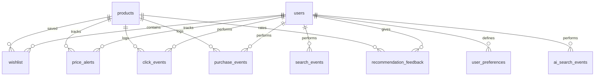

# BuySmart Database Documentation

This document describes the schema design, tables, relationships, and indexing strategy for the BuySmart PostgreSQL database.

---

## 1. Schema Overview

BuySmart uses a relational schema with PostgreSQL to store product data, user accounts, preferences, shopping history, price alerts, and admin analytics.

---

## 2. Table Specifications

### users
Stores user accounts, authentication data, roles, and status.

| Column | Type | Constraints | Description |
| :--- | :--- | :--- | :--- |
| `id` | SERIAL | PRIMARY KEY | Unique identifier |
| `email` | VARCHAR(320) | UNIQUE, NOT NULL, INDEX | Primary identifier |
| `name` | VARCHAR(120) | NOT NULL | User's full name |
| `phone_number` | VARCHAR(20) | UNIQUE, INDEX | Optional phone contact |
| `password_hash` | VARCHAR(255) | NOT NULL | Hashed password |
| `is_admin` | BOOLEAN | DEFAULT FALSE, INDEX | Admin flag |
| `role` | VARCHAR(20) | DEFAULT 'user' | Access control role |
| `is_active` | BOOLEAN | DEFAULT TRUE, INDEX | Account status |
| `created_at` | TIMESTAMP | DEFAULT NOW(), INDEX | Creation date |
| `last_login` | TIMESTAMP | NULL | Last login timestamp |

### products
Stores cached and scraped comparison items.

| Column | Type | Constraints | Description |
| :--- | :--- | :--- | :--- |
| `id` | SERIAL | PRIMARY KEY | Unique identifier |
| `name` | VARCHAR(500) | NOT NULL, INDEX | Item title |
| `description` | TEXT | NULL | Item details |
| `price` | DOUBLE PRECISION| NOT NULL, INDEX | Current price |
| `original_price`| DOUBLE PRECISION| NULL | List price |
| `rating` | DOUBLE PRECISION| INDEX | Review rating |
| `review_count` | INTEGER | DEFAULT 0, INDEX | Number of reviews |
| `platform` | VARCHAR(100) | NOT NULL, INDEX | Amazon, Flipkart, etc. |
| `product_url` | VARCHAR(1000) | UNIQUE, NOT NULL | Product page link |
| `image_url` | VARCHAR(1000) | NULL | Item image link |
| `category` | VARCHAR(200) | INDEX | Category classification |
| `brand` | VARCHAR(200) | NULL | Brand name |
| `availability` | VARCHAR(50) | DEFAULT 'In Stock' | Stock status |
| `last_updated` | TIMESTAMP | DEFAULT NOW(), INDEX | Last scraped timestamp |
| `recommendation_score` | DOUBLE PRECISION | DEFAULT 0.0, INDEX | AI score |

### wishlist
Stores saved items per user.

| Column | Type | Constraints | Description |
| :--- | :--- | :--- | :--- |
| `id` | SERIAL | PRIMARY KEY | Unique identifier |
| `user_id` | INTEGER | FOREIGN KEY (users.id), NOT NULL | Owning user |
| `product_id` | INTEGER | FOREIGN KEY (products.id), NOT NULL | Saved product |
| `added_at` | TIMESTAMP | DEFAULT NOW() | Date added |

*Constraint:* UNIQUE(`user_id`, `product_id`) to prevent duplicate wishlist records.

### price_alerts
Tracks price drop alerts set by users.

| Column | Type | Constraints | Description |
| :--- | :--- | :--- | :--- |
| `id` | SERIAL | PRIMARY KEY | Unique identifier |
| `user_id` | INTEGER | FOREIGN KEY (users.id), NOT NULL | Owning user |
| `product_id` | INTEGER | FOREIGN KEY (products.id), NOT NULL | Tracked product |
| `platform` | VARCHAR(100) | NOT NULL | Product platform |
| `target_price` | DOUBLE PRECISION| NOT NULL | Target alert price |
| `is_active` | BOOLEAN | DEFAULT TRUE | Active flag |
| `created_at` | TIMESTAMP | DEFAULT NOW() | Created date |

*Constraint:* UNIQUE(`user_id`, `product_id`, `platform`) to prevent duplicate alerts per item.

### search_events
Logs keyword queries for history and analytics.

| Column | Type | Constraints | Description |
| :--- | :--- | :--- | :--- |
| `id` | SERIAL | PRIMARY KEY | Unique identifier |
| `user_id` | INTEGER | FOREIGN KEY (users.id), NULL | Searching user (optional) |
| `query` | VARCHAR(500) | NOT NULL, INDEX | Search keyword |
| `results_count` | INTEGER | DEFAULT 0 | Number of results |
| `created_at` | TIMESTAMP | DEFAULT NOW(), INDEX | Search time |

---

## 3. Analytics & Recommendation Logs

### click_events
Logs clicks on comparison links for CTR tracking.

| Column | Type | Constraints | Description |
| :--- | :--- | :--- | :--- |
| `id` | SERIAL | PRIMARY KEY | Unique identifier |
| `user_id` | INTEGER | FOREIGN KEY (users.id), NULL | Optional user |
| `product_id` | INTEGER | FOREIGN KEY (products.id), NOT NULL | Clicked product |
| `platform` | VARCHAR(100) | NOT NULL | Clicked platform |
| `source` | VARCHAR(100) | DEFAULT 'search' | 'recommendation' or 'search' |
| `created_at` | TIMESTAMP | DEFAULT NOW() | Event time |

### scraping_logs
Tracks scraper execution health.

| Column | Type | Constraints | Description |
| :--- | :--- | :--- | :--- |
| `id` | SERIAL | PRIMARY KEY | Unique identifier |
| `platform` | VARCHAR(100) | NOT NULL | Scraped source |
| `status` | VARCHAR(50) | NOT NULL | success, failed, partial |
| `products_scraped`| INTEGER | DEFAULT 0 | Count of items |
| `errors` | TEXT | NULL | Error traceback if failed |
| `started_at` | TIMESTAMP | DEFAULT NOW() | Start time |
| `completed_at` | TIMESTAMP | NULL | End time |
| `duration_seconds`| DOUBLE PRECISION | NULL | Execution time |

### recommendation_feedback
Stores user interactions with recommended products.

| Column | Type | Constraints | Description |
| :--- | :--- | :--- | :--- |
| `id` | SERIAL | PRIMARY KEY | Unique identifier |
| `user_id` | INTEGER | FOREIGN KEY (users.id), NOT NULL | Reviewing user |
| `product_id` | INTEGER | FOREIGN KEY (products.id), NOT NULL | Rated item |
| `feedback_type` | VARCHAR(50) | NOT NULL | 'like', 'dislike', etc. |
| `created_at` | TIMESTAMP | DEFAULT NOW() | Date provided |

*Constraint:* UNIQUE(`user_id`, `product_id`) to prevent duplicate feedback records.
